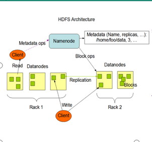
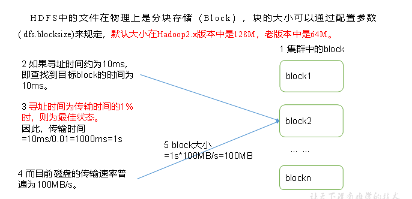

# HDfS
## 概述
### 产出背景及定义
#### 产出背景
```text
随着数据量越来越大,一个操作系统存不下所有的数据,那么就分配到更多的操作系统中,但是不方便管理和维护,迫切需要一种系统来管理所有操作系统上的文件,这就是分布式文件管理系统,HDFS只是分布式文件管理系统中的一种
```
#### HDFS 定义
```text
HDFS(Hadoop Distributed File System),他是一个文件系统,用于存储文件,通过目录树来定位文件;其次,他是分布式的,有很多服务器联合起来实现功能,集群中的服务器各有各自的角色

HDFS的使用场景:适合一次写入,多次读出的场景,且不支持文件的修改,适合用来做数据分析,不适合做网盘类应用
```

#### HDFS的优缺点
##### 优点
- 1.高容错性
    a.数据自动保存多个副本,通过增加副本的形式,提高容错性
    b.某一个副本丢失了以后,自动恢复
- 2.适合处理大数据
    a.数据规模:能够处理GB,TB,甚至PB规模的数据
    b.文件规模:能够处理百万规模以上的文件数量,数量很大
- 3.可以建立在廉价的机器上,通过多副本的机制,提高可靠性

##### 缺点
- 1.不适合低延时数据访问,比如毫秒级别的,是做不到的
- 2.无法高效的对大量小文件进行存储
    a.存储大量小文件的话,会占用namenode大量的内存来存储文件目录和块信息,这样是不可取的,因为namenode的内存总是有限的
    b.小文件的存储寻址时间会超过读取时间,这样违背了hdfs的设计目标
- 3.不支持并发写入,随机修改
    a.一个文件只能有一个写,不允许多个线程写入
    b.仅支持数据追加,不支持文件的随机修改

#### HDFS 组成架构


- 1.namenode (nn),就是master,一个管理者  
    a.管理hdfs的名称空间  
    b.配置副本策略  
    c.管理数据块的映射信息  
    d.处理客户端读写请求  

- 2.datanode (dn)就是slave,namenode执行命令,slave进行相应的操作  
    a.存储实际的数据块  
    b.执行数据块的读写操作
- 3.client 客户端
    a.文件切分,文件上传hdfs的时候,client将文件切分成一个一个的block,然后进行上传  
    b.与namenode交互,获取文件的位置信息  
    c.与datanode交互,读取或写入数据  
    d.client可以提供一些命令来管理hdfs,比如格式化  
    e.cleint可以通过一些命令来访问hdfs,进行增删查改  
- 4.Secondary NameNode: 并非namenode的热备,当namenode挂掉的时候,并不能马上替换namenode并且提供服务  
    a.辅助namenode,分担其工作量,比如定期合并fsimage和edits,并且推送给namenode  
    b.在紧急情况下,可以辅助恢复namenode  

#### HDFS文件块大小
```txt
HDFS中的文件在物理上是分块存储(block),块大小可以通过配置dfs.blocksize来规定,默认其大小在Hadoop2.x版本中是128M,老的版本是64M
```



```
为什么hdfs的块不能设置太大,也不能设置太小呢?

1.hdfs块设置的太小,会增加寻址时间,程序一直在寻找块的位置
2.如果块设置的太大,从磁盘传输数据的时间会明显大于定位这个块需要的时间,导致程序在处理这个块时会非常缓慢

总结:hdfs块的大小主要取决于磁盘传输速度
```

### 一些简单的shell操作
```shell
# 基本语法:
# hadoop fs 具体命令 or hdfs dfs 具体命令
# dfs是fs的实现类


# -help 输出这个命令的参数
hdfs dfs -help mkdir

# -ls 显示目录信息
hdfs dfs -ls /

# -mkdir 在HDFS上创建目录
hdfs dfs -mkdir /test

# -appendToFile 追加一个文件到一个已经存在的文件末尾
vi 111.txt

hdfs dfs -put 111.txt /test

vi 222.txt

hdfs dfs -appendToFile 222.txt /test/111.txt

# -cat 查看文件内容
hdfs dfs -cat /test/111.txt

# -chmod -chown -chgrp 同linux文件用法一样
hdfs dfs -chmod 755 /test/111.txt

# -cp 从hdfs的一个目录复制到另一个目录
hdfs dfs -mkdir /demo
hdfs dfs -cp /test/111.txt  /demo

# -mv 在hdfs中移动文件
hdfs dfs -mkdir /test2
hdfs dfs -mv /demo/111.txt /test2

# -get 从hdfs中下载文件到本地
hdfs dfs -get /test2/111.txt ./

# -getmerge 合并下载多个文件,比如hdfs目录下有多个文件111.txt,222.txt, 将会合并在一起下载到test.txt
touch 222.txt
hdfs dfs -put 222.txt /test2
 hdfs dfs -getmerge /test/*  /test2/*  ./test.txt

# -put 本地上传文件值hdfs
touch 333.txt
hdfs dfs -put 333.txt /test

# -tail 显示一个文件的结尾
hdfs dfs -tail /test/111.txt

# -rm 删除文件或者文件夹
hdfs dfs -rm /test/111.txt

# -rmdir 删除空目录
hdfs dfs -mkdir /test3
hdfs dfs -rmdir /test3

# -du 统计文件大小信息
hdfs dfs -du -s /test
hdfs dfs -du -s -h /test

# -setrep 设置hdfs中文件的副本数量
hdfs dfs -setrep 2 /test/111.txt
 
# 这里设置的副本数只是记录在NameNode的元数据中，是否真的会有这么多副本，还得看DataNode的数量。因为目前只有3台设备，最多也就3个副本，只有节点数的增加到10台时，副本数才能达到10。

```


