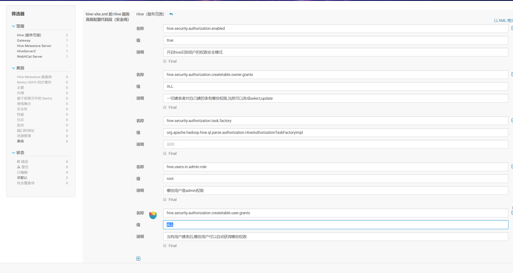
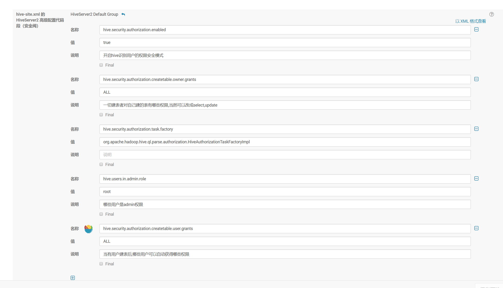

# hive配置用户权限

> 修改hive-site.xml

``` shell
hive.security.authorization.enabled=true
hive.security.authorization.createtable.owner.grants=ALL
hive.security.authorization.task.factory=org.apache.hadoop.hive.ql.parse.authorization.HiveAuthorizationTaskFactoryImpl
hive.users.in.admin.role=root
hive.security.authorization.createtable.user.grants=ALL
```





部署客户端配置之后重启 shell也重新登录一下

> 进入hive命令行添加角色
``` shell
# 开启权限
set hive.security.authorization.enabled=true;

set hive.security.authorization.task.factory = org.apache.hadoop.hive.ql.parse.authorization.HiveAuthorizationTaskFactoryImpl;

# 创建一个测试数据库
create database test;

# 创建3个测试表
create table IF NOT EXISTS test.test_table
(
 ip string COMMENT 'id',
 user string 
)
COMMENT 'Test table';

create table IF NOT EXISTS test.test_table2
(
 ip string COMMENT 'id',
 user string 
)
COMMENT 'Test table';

create table IF NOT EXISTS test.test_table4
(
 ip string COMMENT 'id',
 user string 
)
COMMENT 'Test table';

# 给test_role角色 表的权限
GRANT SELECT on table test.test_table to group test_role;

# 给vlog用户测试表的权限
GRANT SELECT on table test.test_table2 to user vlog;

# 此时vlog用户是没有test_table 的权限的 拥有test_table2的权限,使用vlog用户测试
select count(*) from test.test_table2;
select count(*) from test.test_table4;

```

> 权限常用命令
``` shell
# 假设用户是vlog 角色是test_role 数据库是test

# 创建角色
CREATE ROLE test_role; 

# 分配角色给用户
GRANT ROLE test_role TO USER vlog; 

# 数据库级别的管理给角色
GRANT CREATE ON DATABASE default TO group test_role;

# 表级别的管理给角色
GRANT SELECT on table test_table to group test_role;
GRANT DROP on table test_table to group test_role;
GRANT ALL on table test_table to group test_role; 

# 直接分配给用户
GRANT CREATE ON DATABASE default TO user vlog;
GRANT SELECT on table test_table to user vlog;
GRANT DROP on table test_table to user vlog;
GRANT ALL on table test_table to user vlog; 

# 分配创建数据库的权限
GRANT CREATE  TO user root; 

# 查看权限分配
SHOW GRANT user vlog ON DATABASE test;   
SHOW GRANT group test_role ON DATABASE test;

# 删除权限
revoke all on database test from user vlog;

```
 


