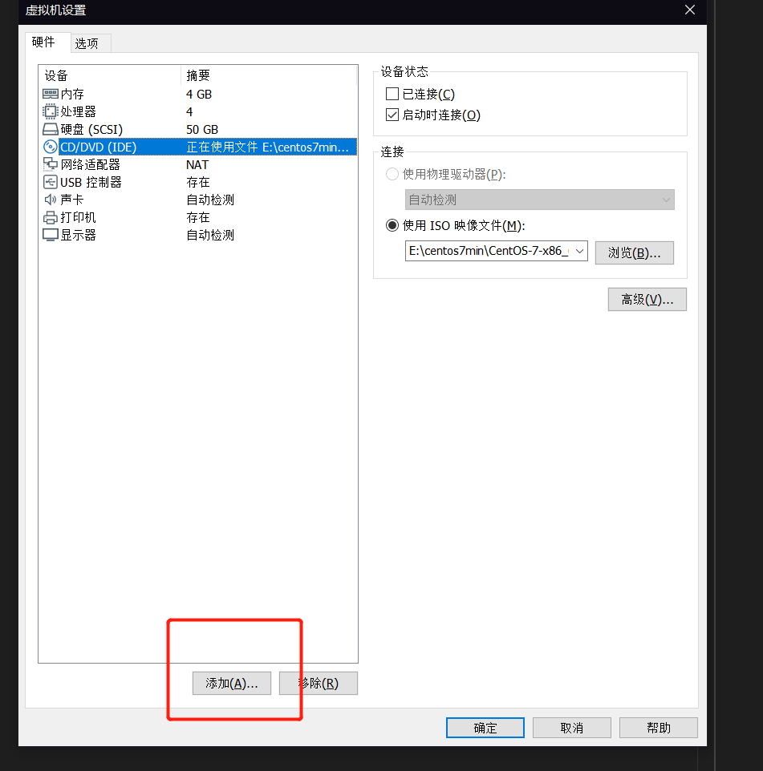
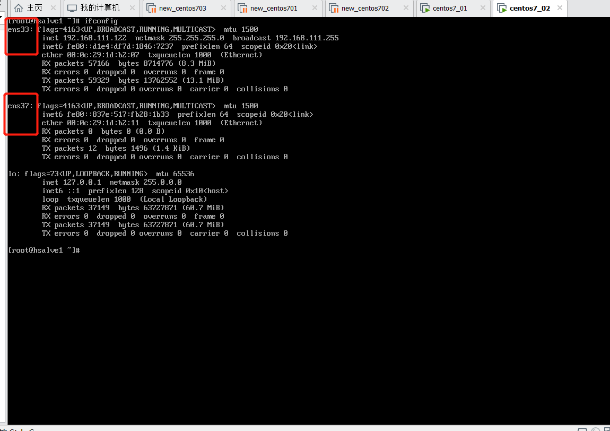

# centos7配置双网卡

### 1.添加双网卡,查看新网卡信息


- ifconfig 查看
  


### 2.配置新网卡信息
```shell
cp /etc/sysconfig/network-scripts/ifcfg-ens33 /etc/sysconfig/network-scripts/ifcfg-ens37

vi /etc/sysconfig/network-scripts/ifcfg-ens37

TYPE=Ethernet
PROXY_METHOD=none
BROWSER_ONLY=no
BOOTPROTO=static
DEFROUTE=yes #注意!,注释掉外网网卡的这个选项,不是这个的
IPV4_FAILURE_FATAL=no
IPV6INIT=yes
IPV6_AUTOCONF=yes
IPV6_DEFROUTE=yes
IPV6_FAILURE_FATAL=no
IPV6_ADDR_GEN_MODE=stable-privacy
NAME=ens37    #修改成新的
#UUID=d0281a34-1d7a-476a-ba39-d73b7705dde1 #注释掉,如果有HWADDR也注释
DEVICE=ens37  #修改成新的
ONBOOT=yes
IPADDR=192.168.1.121   #配置成新网段的地址
NETMASK=255.255.255.0
#GATEWAY=192.168.111.1  #新网卡不需要网关注释掉
#DNS1=192.168.111.1     #注释


service network restart 
```