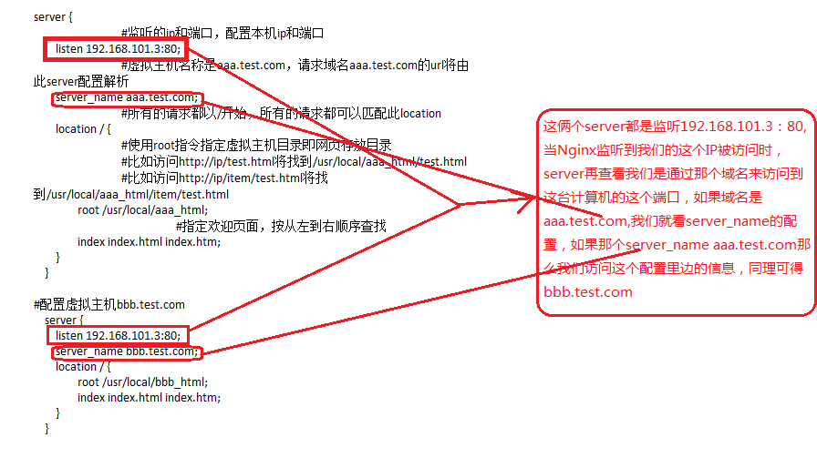
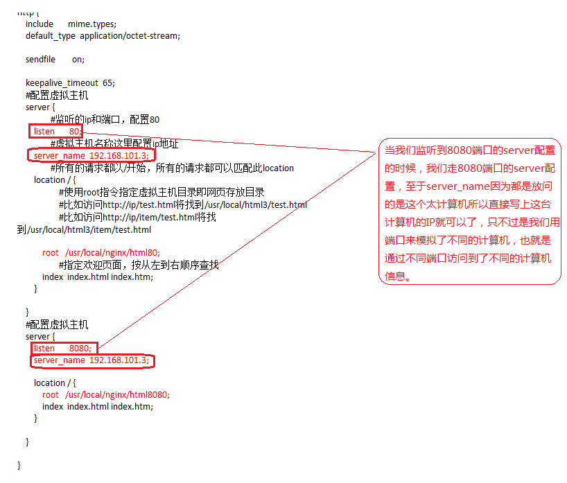

# nginx 简介

Nginx是一款高性能的http 服务器/反向代理服务器及电子邮件（IMAP/POP3）代理服务器。由俄罗斯的程序设计师Igor Sysoev所开发，官方测试nginx能够支支撑5万并发链接，并且cpu、内存等资源消耗却非常低，运行非常稳定。

## nginx 功能

1、http服务器

2、虚拟主机

3、反向代理

### 虚拟主机的配置

#### 基于域名的虚拟主机：

#### 基于端口的虚拟主机：

