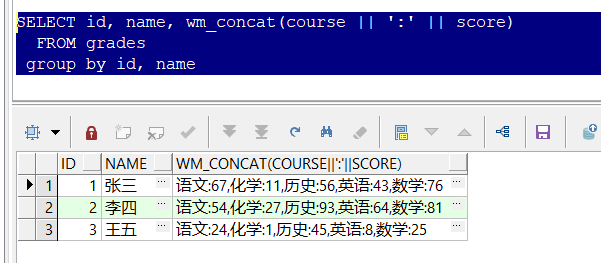

# oracle函数及特殊sql
## 简介
  本文主要记录oracle的一些函数及特殊的一些sql

### oracle删除表中重复记录只保留一条
```
-- 思路:分组查出多条记录的数据,然后删除,并保留rowid最小的记录
DELETE FROM AML_IO_TA_AGENCYINFO
 WHERE AGENCYNO IN (SELECT AGENCYNO
                      FROM AML_IO_TA_AGENCYINFO
                     GROUP BY AGENCYNO
                    HAVING COUNT(*) > 1)
   AND ROWID NOT IN (SELECT MIN(ROWID)
                       FROM AML_IO_TA_AGENCYINFO
                      GROUP BY AGENCYNO
                     HAVING COUNT(*) > 1)
```
### oracle行转列和列转行
```sql
-- 先建表
create table grades
(
  id     NUMBER,
  name   VARCHAR2(20),
  course VARCHAR2(20),
  score  NUMBER
);

-- 插入测试数据
insert into grades (id, name, course, score)
values (1, '张三', '语文', 67);
insert into grades (id, name, course, score)
values (1, '张三', '数学', 76);
insert into grades (id, name, course, score)
values (1, '张三', '英语', 43);
insert into grades (id, name, course, score)
values (1, '张三', '历史', 56);
insert into grades (id, name, course, score)
values (1, '张三', '化学', 11);
insert into grades (id, name, course, score)
values (2, '李四', '语文', 54);
insert into grades (id, name, course, score)
values (2, '李四', '数学', 81);
insert into grades (id, name, course, score)
values (2, '李四', '英语', 64);
insert into grades (id, name, course, score)
values (2, '李四', '历史', 93);
insert into grades (id, name, course, score)
values (2, '李四', '化学', 27);
insert into grades (id, name, course, score)
values (3, '王五', '语文', 24);
insert into grades (id, name, course, score)
values (3, '王五', '数学', 25);
insert into grades (id, name, course, score)
values (3, '王五', '英语', 8);
insert into grades (id, name, course, score)
values (3, '王五', '历史', 45);
insert into grades (id, name, course, score)
values (3, '王五', '化学', 1);
commit;
```


```sql
-- 行转列:是将多行记录根据某一列转换成一行记录
-- 例如上方成绩表,学生的成绩分多行存储在表中,现在需要将一个学生的多条成绩合并成一条,可以用decode,case when,以及oracle 11g新函数PIVOT

-- decode 这里用max,min,sum都可以,因为每个科目都只对应一条记录
select id,
       name,
       max(decode(course, '语文', score, 0)),
       max(decode(course, '数学', score, 0)),
       max(decode(course, '英语', score, 0)),
       max(decode(course, '历史', score, 0)),
       max(decode(course, '化学', score, 0))
  from grades
 group by name, id

-- case when
 select id,
        name,
        max(case course
          when '语文' then
           score
          else
           0
        end),
        max(case course
          when '数学' then
           score
          else
           0
        end),
        max(case course
          when '英语' then
           score
          else
           0
        end),
        max(case course
          when '历史' then
           score
          else
           0
        end),
        max(case course
          when '化学' then
           score
          else
           0
        end)
   from grades
  group by name, id

-- PIVOT oracle 11g 之后的新函数
select id, name, china, math, english, history, hx
  from (SELECT id, name, course, score FROM grades)
pivot(sum(score)
   for course in('语文' as china,
                 '数学' as math,
                 '英语' as english,
                 '历史' history,
                 '化学' hx))

```


```sql
-- 延伸函数 wm_concat,将该列全部合并成一行,逗号分隔
-- 例如:合并成科目:成绩的形式
SELECT id, name, wm_concat(course || ':' || score)
  FROM grades
 group by id, name
```


```sql
-- 列转行:将一条记录根据某一列转换成多行
-- 创建newgrades,数据是之前行转列的数据
create table newgrades as (select id, name, china, math, english, history, hx
  from (SELECT id, name, course, score FROM grades)
pivot(sum(score)
   for course in('语文' as china,
                 '数学' as math,
                 '英语' as english,
                 '历史' history,
                 '化学' hx)))
```


```sql
-- union all 需要写很多
SELECT id, name, '语文' course, china score
  FROM newgrades
union all
SELECT id, name, '数学' course, math score
  FROM newgrades
union all
SELECT id, name, '英语' course, english score
  FROM newgrades
union all
SELECT id, name, '历史' course, history score
  FROM newgrades
union all
SELECT id, name, '化学' course, hx score
  FROM newgrades

-- unpivot
select id, name, course, score
  from newgrades unpivot(score for course in(china as '语文',
                                              math as '数学',
                                              history as '历史',
                                              english as '英语',
                                              hx as '化学'))


```