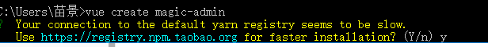
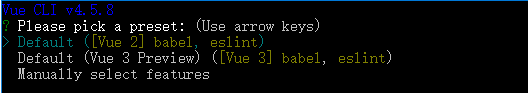
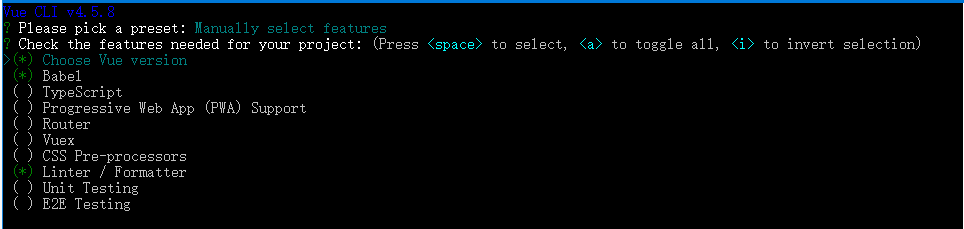
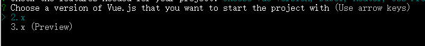
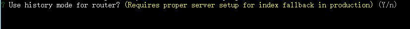
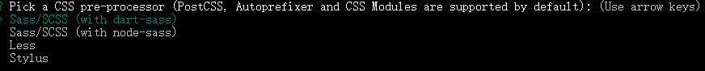
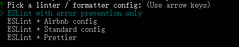
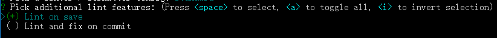
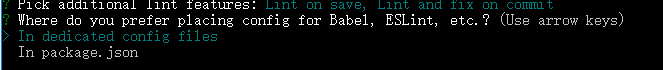
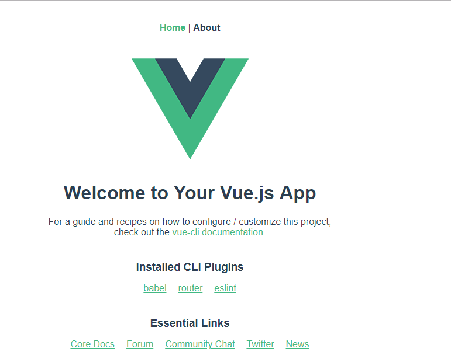

# 环境搭建

## 使用vueclient 创建

> 创建项目

```shell
# 先安装vueclient
npm install --global @vue/cli

# 创建项目
vue create magic-admin
```

> 选择镜像 输入y

 

> 选择第三个手动选择选项

 

> 选择 Babel  : es6 转 es5),
>
> ​		 Router : 路由
>
> ​		 CSS Pre-processors：CSS 预处理器，后面会提示你选择 less、sass、stylus 等 
>
> ​		 Linter / Formatter：代码格式校验，ESLint 代码格式校验



> 选择vue版本 3.x

 

> 是否使用 history 路由模式，这里输入 n 不使用



>选择 CSS 预处理器，这里选择我们熟悉的 Less



> 选择校验工具，这里选择 ESLint + Standard config

 

> 选择在什么时机下触发代码格式校验： 
>
> • Lint on save：每当保存文件的时候 
>
> • Lint and fix on commit：每当执行 git commit 提交的时候 
>
> 这里建议两个都选上，更严谨。



> Babel、ESLint 等工具会有一些额外的配置文件，这里的意思是问你将这些工具相关的配置
>
> 文件写到哪里：
>
> • In dedicated config files：分别保存到单独的配置文件
>
> • In package.json：保存到 package.json 文件中
>
> 这里建议选择第 1 个，保存到单独的配置文件，这样方便我们做自定义配置。

 

>  这里里是问你是否需要将刚才选择的一系列配置保存起来，然后它可以帮你记住上面的一系列选择，以便下次直接重用。

 

```shell
# 安装完毕之后启动 访问localhost:8080,可以看到如下页面
npm run serve
```



## 加入git版本控制

> vueclient在创建时已经自动帮忙初始化了git仓库,如果没有仓库需要先初始化,已经有的可以直接推送到远程仓库

```shell
# 初始化本地仓库
git init
# 把文件添加到暂存区
git add README.md
# 把暂存区文件提交到本地仓库形成历史记录
git commit -m "first commit"

# 添加远端仓库地址到本地仓库
git remote add origin https://github.com/lipengzhou/toutiao-publish-admin.git
# 推送到远程仓库
git push -u origin master
```

