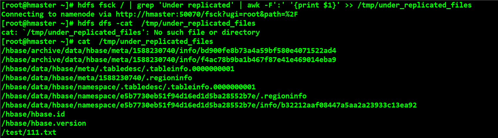
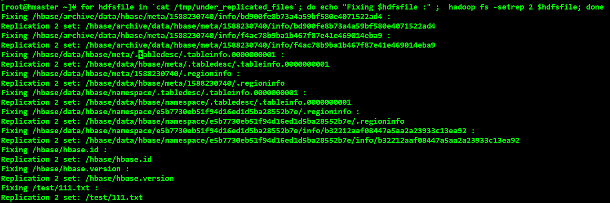

# Cloudera Manage 问题记录
## HDFS 界面提示 "HDFS under replicated blocks"
****
```` shell
# 找出没有复制的block
hdfs fsck / | grep 'Under replicated' | awk -F':' '{print $1}' >> /tmp/under_replicated_files 
````



```` shell
# 循环修复打印日志
for hdfsfile in `cat /tmp/under_replicated_files`; do echo "Fixing $hdfsfile :" ;  hadoop fs -setrep 3 $hdfsfile; done
````




